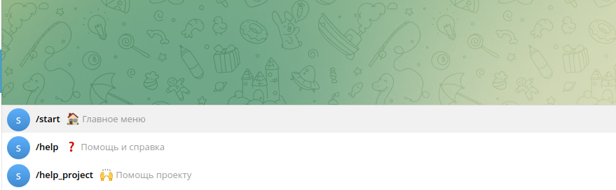
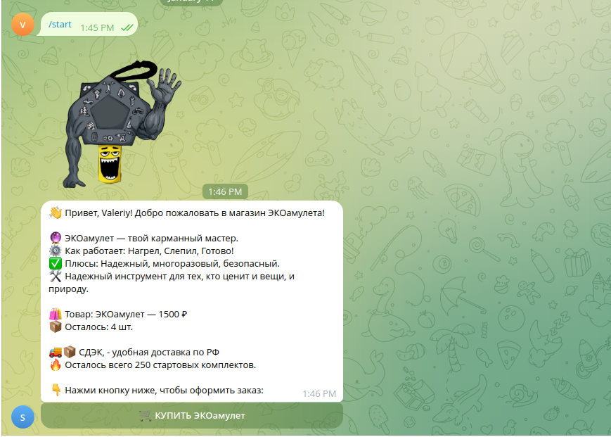
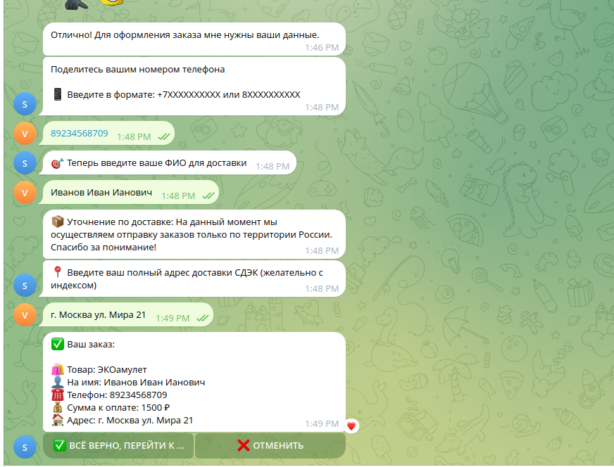
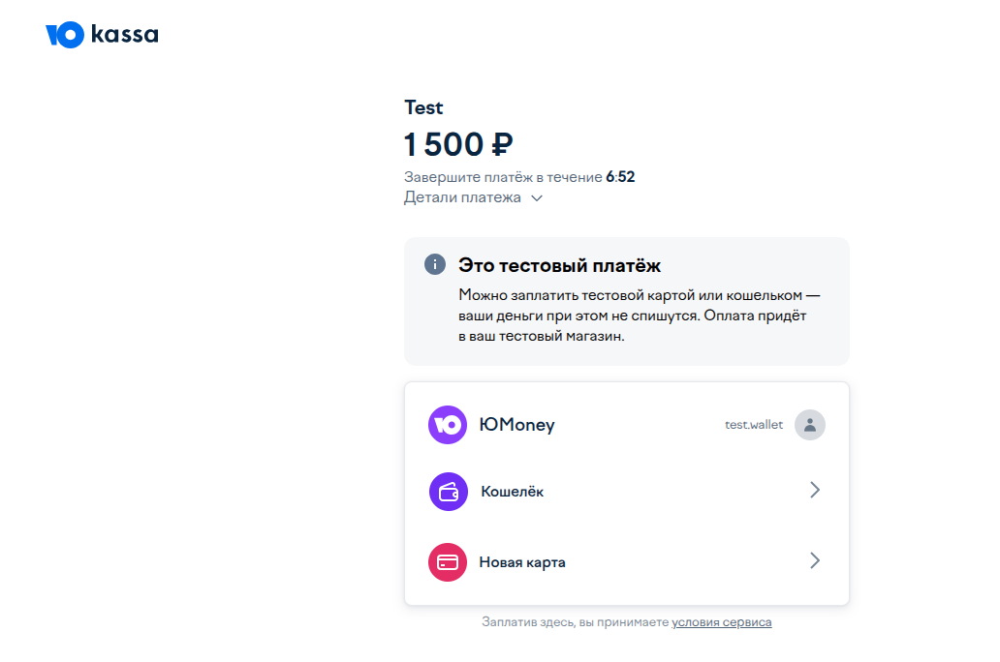
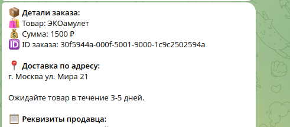
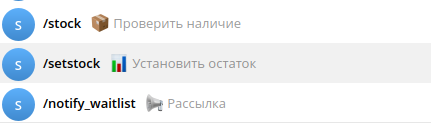
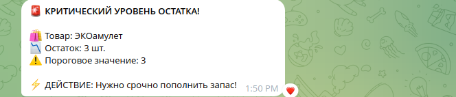

# 📂 Кейс 4: Масштабируемая система продаж (E-commerce Bot)

## 🎯 О проекте: Автоматизация розничных продаж и учета

**Задача:** Создание надежного инструмента для ведения коммерческой деятельности в Telegram: от витрины товаров до приема оплаты и автоматического складского учета.

**Решение:** Разработан высокопроизводительный асинхронный бот с интеграцией платежных шлюзов и облачной CRM-системой на базе Google Sheets.

## ⚙️ Технологический Стек

| Категория | Описание/Технология |
| :--- | :--- |
| **Язык** | Python (Asyncio) |
| **Фреймворк** | python-telegram-bot (v20+) |
| **Платежный шлюз** | ЮKassa (интеграция через Webhooks) |
| **База данных / CRM** | Google Sheets API (gspread) |
| **Надежность** | Механизмы Retry и Asyncio Locks |

## 💡 Ключевые Преимущества и Ценность

*   **Безопасность сделок:** Реализована атомарная проверка остатков (Locks) — два покупателя никогда не купят последний товар одновременно.
*   **Отказоустойчивость:** Система «Graceful Degradation» — если Google-таблицы временно недоступны, бот сохраняет данные локально и синхронизирует их позже.
*   **Автоматизация учета:** Каждая продажа мгновенно фиксируется в облачной таблице, что заменяет полноценную CRM для малого бизнеса.
*   **Валидация данных:** Встроенная проверка корректности контактных данных (телефоны, адреса) перед переходом к оплате.

## 📸 Скриншоты проекта

*   **Пользовательский интерфейс выбора категорий и товаров.**
    
    -
    
    -
    

*   **Генерация платежной ссылки и подтверждение транзакции.**
    
    
    
    

*   **Чат Администратора.**
    
    
    

