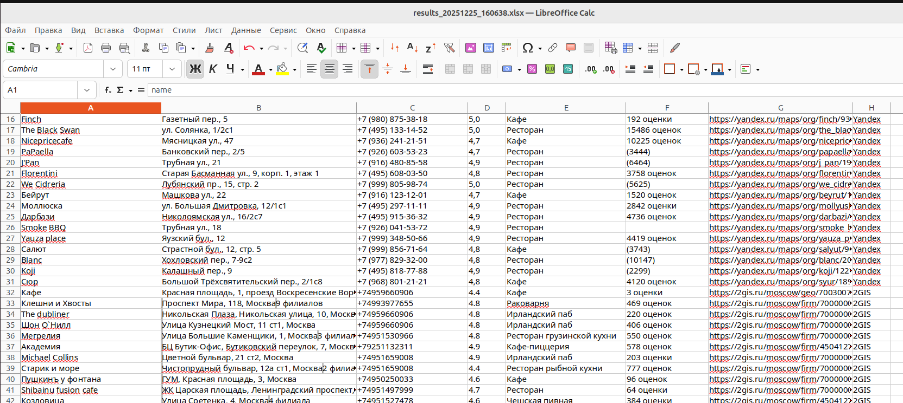
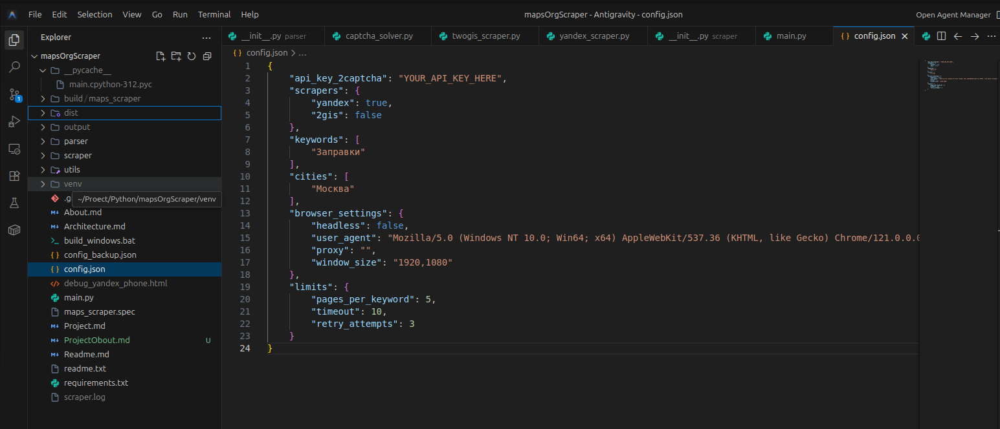

# 📂 Кейс 5: MapsOrgScraper — Интеллектуальная система сбора данных с геосервисов

## 🎯 О проекте: Профессиональный парсинг бизнес-данных

**Задача:** Разработка автономного инструмента для массового извлечения информации об организациях (названия, телефоны, рейтинги) с Яндекс.Карт и 2ГИС.

**Решение:** Создано модульное Python-приложение на базе Selenium, способное обрабатывать динамический контент (SPA) и обходить системы защиты от ботов.

## ⚙️ Технологический Стек

| Категория | Описание/Технология |
| :--- | :--- |
| **Browser Automation** | Selenium (ChromeDriver) |
| **Captcha Solving** | Интеграция с API 2Captcha |
| **Data Processing** | Pandas для формирования сложных датасетов |
| **Export** | OpenPyXL (генерация Excel-отчетов) |
| **Architecture** | Layer-based (разделение на скрейпинг, парсинг и утилиты) |

## 💡 Ключевые Преимущества и Ценность

*   **Умный парсинг:** Реализован каскад стратегий (Fallback Selectors) — если верстка сайта меняется, система автоматически пробует альтернативные методы поиска данных.
*   **Обход защиты:** Интеграция с сервисом 2Captcha позволяет автоматически решать капчи, обеспечивая непрерывную работу парсера.
*   **Работа с SPA:** Скрипт корректно обрабатывает "тяжелые" Single Page Applications (2ГИС), используя продвинутые механизмы ожидания элементов и обработку ошибок `StaleElementReferenceException`.
*   **Автономность:** Настроена автоматическая установка и обновление необходимых драйверов через WebDriver Manager, что делает инструмент переносимым.

## ⚙️ Техническая реализация

*   **Модульность:** Логика извлечения данных полностью изолирована от логики управления браузером в классе `DataParser`.
*   **Оркестрация:** Система последовательно перебирает города и ключевые слова из `config.json`, управляя жизненным циклом браузера для экономии памяти.

## 📸 Скриншоты проекта

*   **Итоговая таблица с собранными данными: контакты, адреса и рейтинги организаций.**
    

*   **Демонстрация модульной архитектуры и чистоты организации кода.**
    
