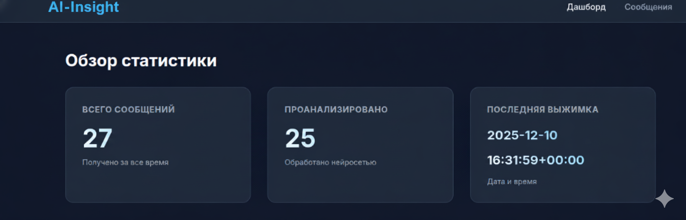
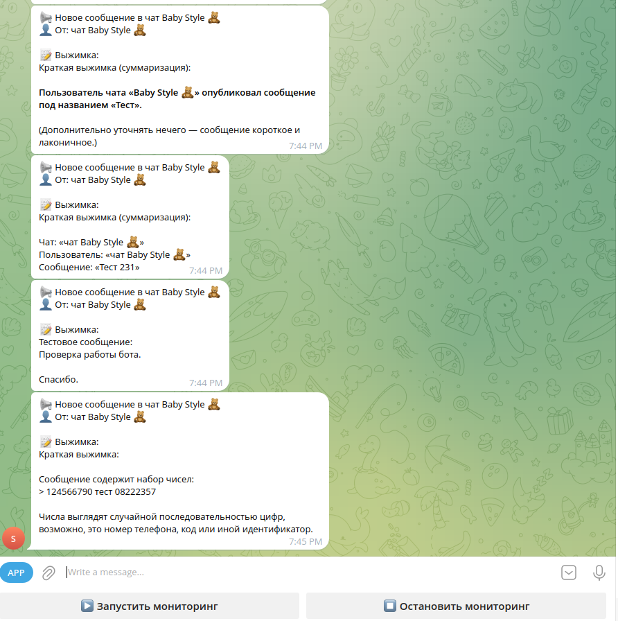

# 📂 Кейс 6: AI-Insight — Экосистема мониторинга чатов и ИИ-аналитики

## 🎯 О проекте: Комплексная система сбора и анализа сообщений

**Задача:** Создание инструмента для мониторинга множества Telegram-каналов в реальном времени, сохранения данных и предоставления интерфейса для аналитики с помощью ИИ.

**Решение:** Разработана модульная архитектура, объединяющая «слушателя» на Telethon (сбор данных), аналитического бота с GigaChat и веб-дашборд на Flask для визуализации.

## ⚙️ Технологический Стек

| Категория | Описание/Технология |
| :--- | :--- |
| **Data Collection** | Telethon (MTProto API) для работы от лица пользователя |
| **AI Integration** | GigaChat API (интеллектуальный анализ контекста) |
| **Web Dashboard** | Flask (визуализация статистики и логов) |
| **Database** | SQLite (единое хранилище для всех модулей) |
| **Interface** | AsyncTeleBot (асинхронное взаимодействие) |

## 💡 Ключевые Преимущества и Ценность

*   **Real-time Мониторинг:** Система работает в фоне, мгновенно перехватывая сообщения без использования официальных Bot API (технология Userbot).
*   **ИИ-аналитика:** Автоматическая классификация сообщений и возможность задавать вопросы по накопленной базе знаний через GigaChat.
*   **Централизованное управление:** Полноценный веб-интерфейс (MiniApp) с темной темой для просмотра статистики через браузер.
*   **Синхронизация:** Все компоненты (сборщик, бот и сайт) работают в связке с единой БД, обеспечивая целостность данных.

## 📸 Скриншоты проекта

*   **Интерфейс со списком последних сообщений, фильтрами и графиками активности.**
    

*   **Демонстрация ИИ-ответов на основе собранной информации из каналов.**
    

*   **MiniApp.**
    
